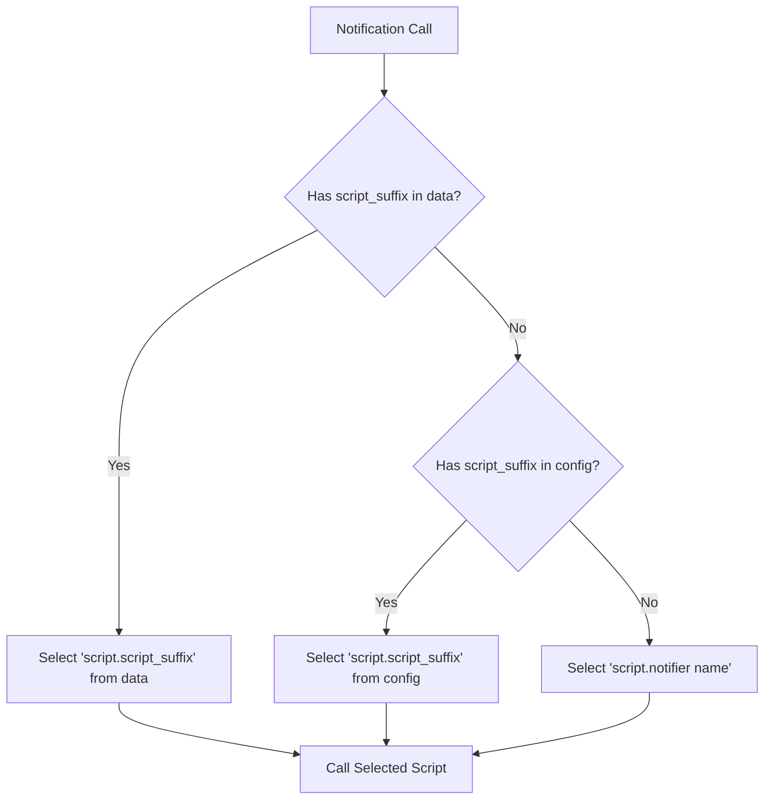
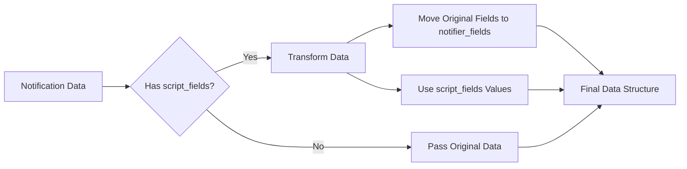

# NotiScript – Custom Notification Platform for Home Assistant

- [1. State of this software](#1-state-of-this-software)
- [2. Features](#2-features)
- [3. Installation](#3-installation)
  - [3.1. Install via HACS (recommended)](#31-install-via-hacs-recommended)
  - [3.2. Install manually from repository](#32-install-manually-from-repository)
- [4. Most simple use case](#4-most-simple-use-case)
- [5. More advanced configuration](#5-more-advanced-configuration)
- [6. How It Works](#6-how-it-works)
  - [6.1. Selecting the script](#61-selecting-the-script)
    - [6.1.1. Short version](#611-short-version)
    - [6.1.2. Long version](#612-long-version)
  - [6.2. Adding custom data (`script_fields`)](#62-adding-custom-data-script_fields)
    - [6.2.1. Short version](#621-short-version)
    - [6.2.2. Long version](#622-long-version)
- [7. Debugging](#7-debugging)
- [8. License](#8-license)

## 1. State of this software

The integration seems to work fine (at least on my machine 😊).
The documentation is too lengthy and not to the point; i will improve it if anybody shows interest in this software.
I am a programmer but python is new to me and this is my first integration for Home Assistant.

## 2. Features

The main purpose of this integration is to be able to use scripts in contexts where normally only notifiers are supported (the alert integration for example).

- Can be used like any other `notify` platform
- Can be used to create notifiers (services of the form `notify.<my name>`) that forward their calls to a configured script.
- Preserves original notification service data
- Supports dynamic script selection with three priority levels
- Provides adding of custom data to the script call
- All script calls are executed non-blocking, meaning they run asynchronously without waiting for completion.

## 3. Installation

You can find all the code at [GitHub / ha-notiscript](https://github.com/sejnub/ha-notiscript)

### 3.1. Install via HACS (recommended)

To install this integration using [HACS](https://hacs.xyz):

1. Go to **HACS → ⋮ → Custom repositories**
2. Add the repository:
   - Repository: `https://github.com/sejnub/ha-notiscript`
   - Type: `Integration`
3. After adding, search for `NotiScript Notify` in HACS and install it
4. Restart Home Assistant
5. Configure as described in the following text

### 3.2. Install manually from repository

1. Create the folder structure `<config_dir>/custom_components/notiscript/`

2. Add file `__init__.py` to that folder
   > [See code in `__init__.py`](custom_components/notiscript/__init__.py) – or copy from the latest version.

3. Add file `manifest.json` to that folder
   > [See code in `manifest.json`](custom_components/notiscript/manifest.json) – or copy from the latest version.

4. Add file `notify.py` to that folder
   > [See code in `notify.py`](custom_components/notiscript/notify.py) – or copy from the latest version.

5. Restart Home Assistant

## 4. Most simple use case

If you add

```yaml
notify:
  - platform: notiscript
    name: my_notifier
```

to your configuration.yaml then a notifier (*not* an entity, so don't look for it!) `notify.my_notifier` will be created.

This notifier, when called, will forward that call to `script.my_notifier` with all call parameters unchanged.

## 5. More advanced configuration

Add this to your `configuration.yaml`:

```yaml
notify:
  - platform: notiscript
    name: my_notifier
    script_suffix: my_script  # optional
    script_fields:  # optional
      title: I am a new title
      message: I am a new message
```

| Option          | Required | Description                                                                                                                                                                                                       |
| --------------- | -------- | ----------------------------------------------------------------------------------------------------------------------------------------------------------------------------------------------------------------- |
| `name`          | ✅        | The created notifier will be `notify.<name>`                                                                                                                                                                      |
| `script_suffix` | ❌        | The script called will now be `script.<script_suffix>` (instead of `script.<name>` when `script_suffix` is missing)                                                                                               |
| `script_fields` | ❌        | Fields to pass to script. This replaces the original parameters which are moved to `<service data>.data.notifier_fields`. Supports complex values (strings, dictionaries, lists, integers, floats, and booleans). |

## 6. How It Works

NotiScript provides two main transformation mechanisms:

### 6.1. Selecting the script

#### 6.1.1. Short version

Determines which script to call, with three priority levels:

1. From field `script_suffix` in notification data (dynamically when called)
2. From field `script_suffix` in configuration (inside `configuration.yaml`)
3. From notifier name (fallback)

#### 6.1.2. Long version

NotiScript uses a three-level priority system to determine which script to call:



Examples:

```yaml
# Priority 1: Setting the script on notification call
service: notify.my_notifier
data:
  data:
    script_suffix: urgent_script # Will forward to `script.urgent_script`

# Priority 2: Setting the script in `configuration.yaml`
notify:
  - platform: notiscript
    name: my_notifier
    script_suffix: normal_script # Will forward to `script.normal_script`

# Priority 3: From notifier name
notify:
  - platform: notiscript
    name: my_notifier  # Will forward to `script.my_notifier`
```

### 6.2. Adding custom data (`script_fields`)

#### 6.2.1. Short version

Defines how notification data should be transformed before being passed to the script:

1. From notification data
2. From configuration

When `script_fields` is present:

- Original notification fields (`title`, `message`, `target`) are moved to `data.notifier_fields`. All other keys in `data` are untouched
- The key-value-pairs from `script_fields` are passed directly to the script as service data.

#### 6.2.2. Long version

The `script_fields` mechanism allows you to add custom data to the script call. It supports various data types including strings, dictionaries, lists, integers, floats, and booleans. 



Example:

```yaml
# Original Notification
service: notify.my_notifier
data:
  message: "Hello"
  title: "Test"
  data:
    script_fields:
      message: "msg"
      title: "heading"
    custom_field: "value"

# Result Sent to Script
{
    "message": "msg",
    "title": "heading",
    "data": {
        "notifier_fields": {
            "message": "Hello",
            "title": "Test"
        },
        "custom_field": "value"
    }
}
```

## 7. Debugging

Enable debug logging in `configuration.yaml`:

```yaml
logger:
  logs:
    custom_components.notiscript: debug
```

This will show:

- Script selection process
- Data transformation steps
- Final data structure sent to script
- Any errors during execution

## 8. License

See [LICENSE](./LICENSE)
