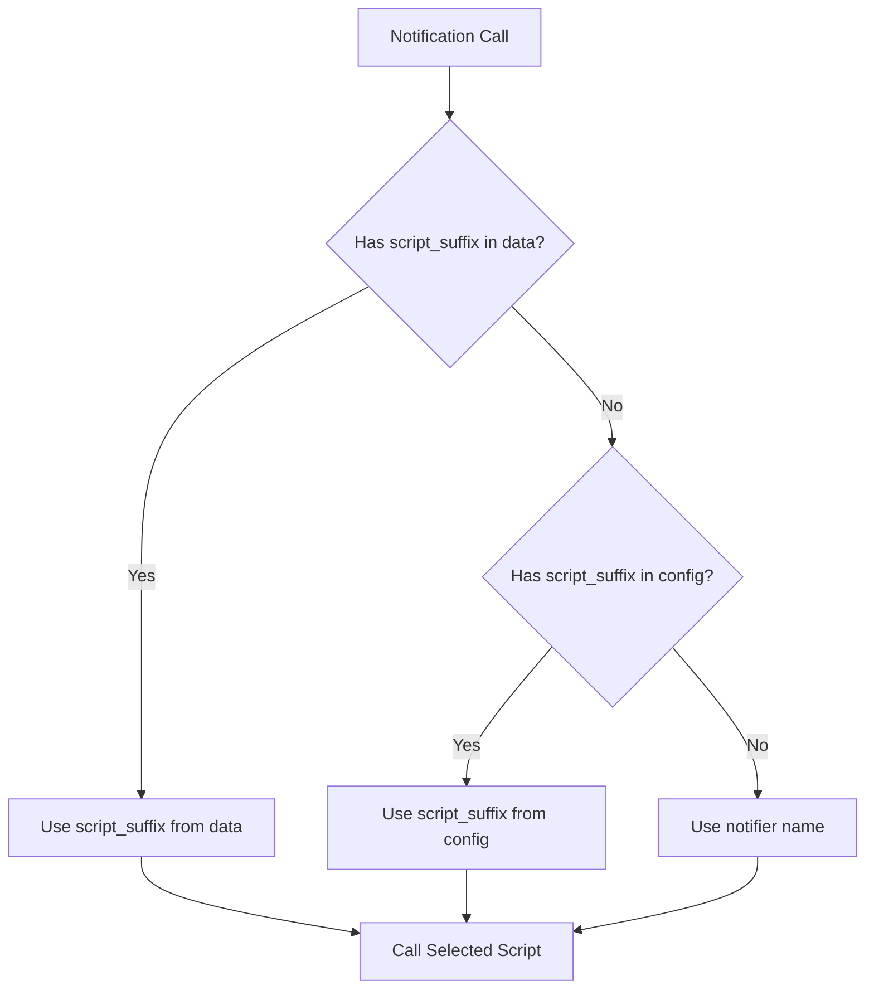
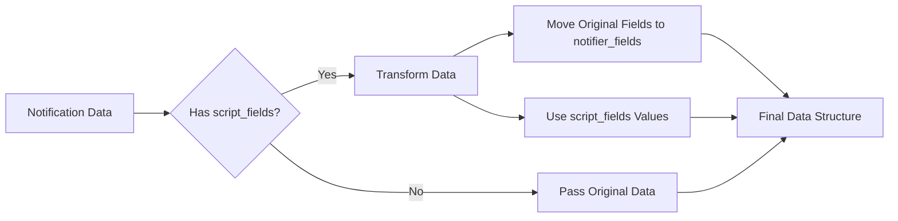
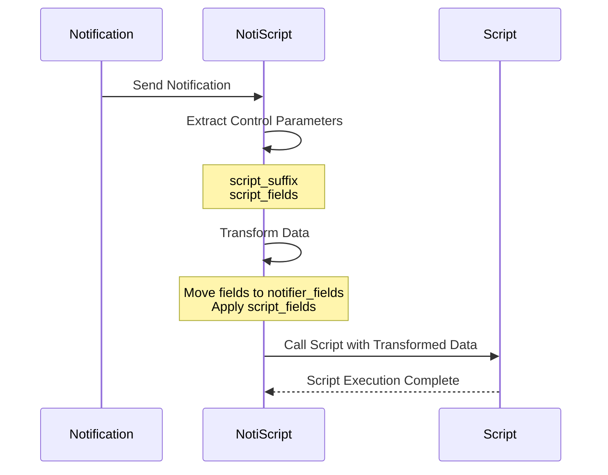
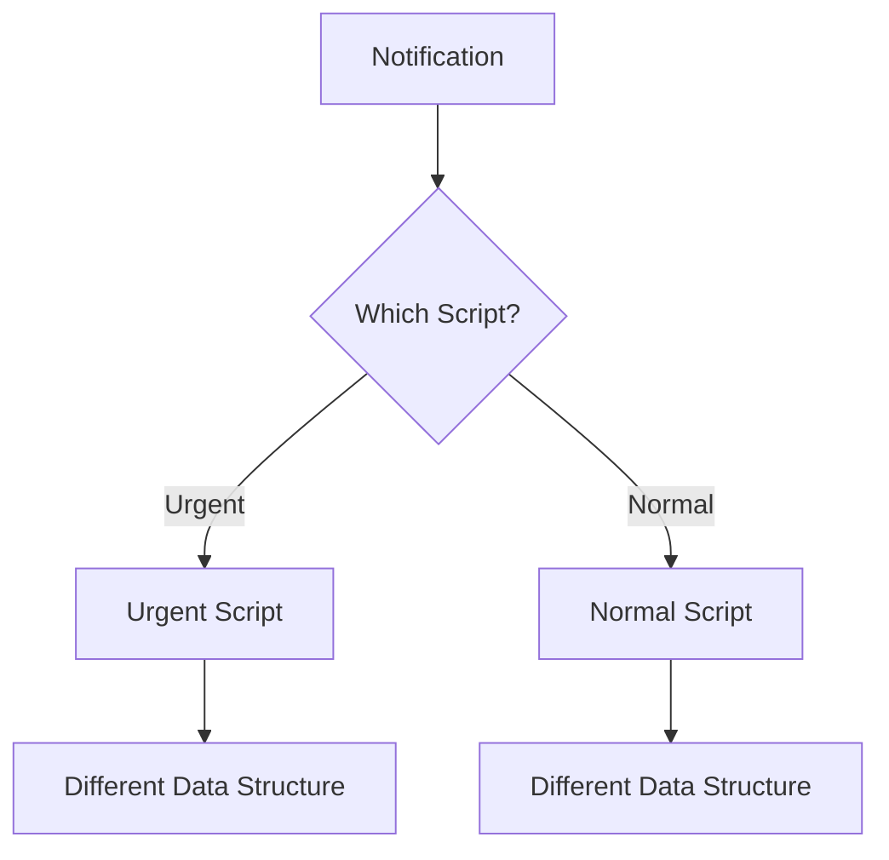
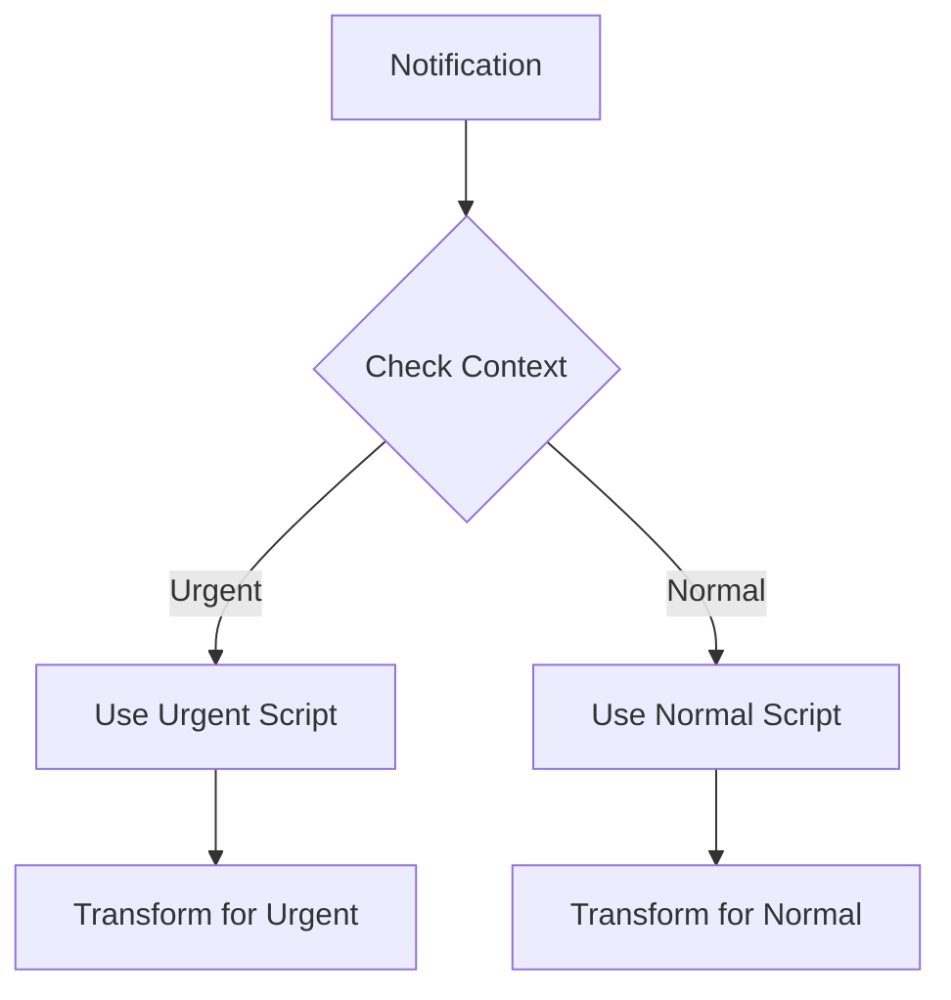
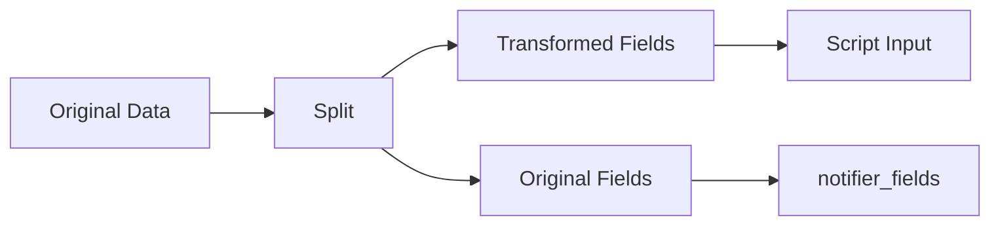
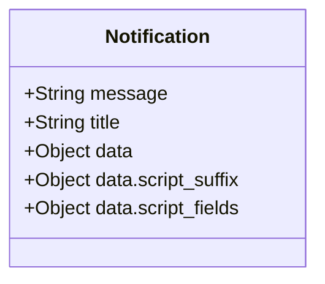
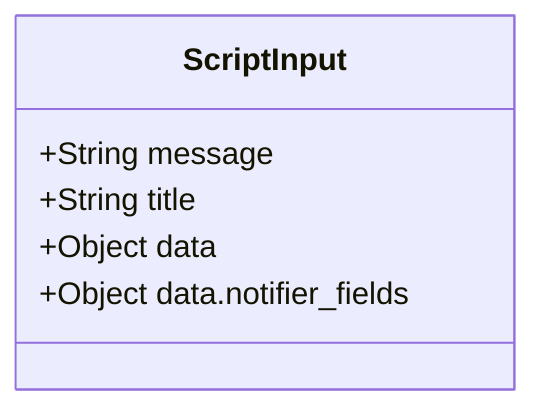

# NotiScript Concept Documentation

## Overview

NotiScript is a notification platform that provides powerful data transformation capabilities when routing notifications to scripts. It allows you to:
1. Dynamically select which script to call
2. Transform notification data before passing it to scripts
3. Preserve original notification data while providing transformed data

## Core Concepts

### 1. Script Selection

NotiScript uses a three-level priority system to determine which script to call:



Example:
```yaml
# Priority 1: From notification data
service: notify.my_notifier
data:
  data:
    script_suffix: urgent_script

# Priority 2: From configuration
notify:
  - platform: notiscript
    name: my_notifier
    script_suffix: normal_script

# Priority 3: From notifier name
notify:
  - platform: notiscript
    name: my_notifier  # Will use script.my_notifier
```

### 2. Data Transformation

The `script_fields` mechanism allows you to transform notification data before it reaches the script:



Example:
```yaml
# Original Notification
service: notify.my_notifier
data:
  message: "Hello"
  title: "Test"
  data:
    script_fields:
      message: "msg"
      title: "heading"
    custom_field: "value"

# Result Sent to Script
{
    "message": "msg",
    "title": "heading",
    "data": {
        "custom_field": "value",
        "notifier_fields": {
            "message": "Hello",
            "title": "Test"
        }
    }
}
```

## Data Flow



## Use Cases

### 1. Multiple Scripts with Different Data Structures



Example:
```yaml
notify:
  - platform: notiscript
    name: urgent_notifier
    script_suffix: urgent_script
    script_fields:
      message: alert
      title: warning
  - platform: notiscript
    name: normal_notifier
    script_suffix: normal_script
    script_fields:
      message: info
      title: status
```

### 2. Dynamic Script Selection



Example:
```yaml
service: notify.my_notifier
data:
  data:
    script_suffix: urgent_script  # Override default script
    script_fields:
      message: alert
      title: warning
```

### 3. Data Preservation with Transformation



Example:
```yaml
service: notify.my_notifier
data:
  message: "Hello"
  title: "Test"
  data:
    script_fields:
      message: "msg"
    custom_field: "value"
```

## Data Structures

### Input Structure


### Output Structure


## Priority System

### Script Selection Priority
1. `data.script_suffix` from notification
2. `script_suffix` from configuration
3. Notifier name as fallback

### Data Transformation Priority
1. `data.script_fields` from notification
2. `script_fields` from configuration

## Best Practices

1. **Configuration**
   - Use configuration for default behavior
   - Keep transformation rules consistent
   - Document expected data structures

2. **Notification Calls**
   - Use data overrides for special cases
   - Preserve original data when needed
   - Keep transformation rules simple

3. **Script Design**
   - Expect transformed data structure
   - Handle both transformed and original fields
   - Document expected input format

## Debugging

Enable debug logging to see:
```yaml
logger:
  logs:
    custom_components.notiscript: debug
```

This will show:
- Script selection process
- Data transformation steps
- Final data structure sent to script
- Any errors during execution 